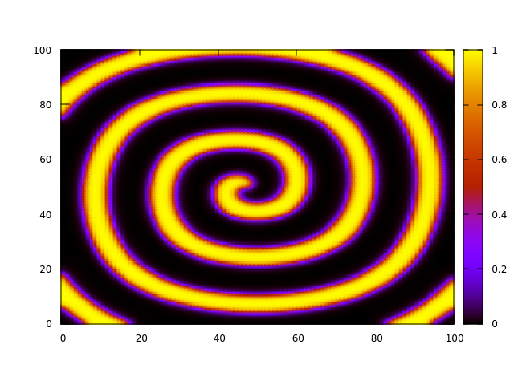
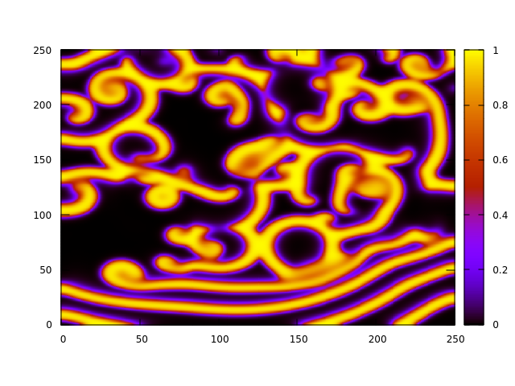
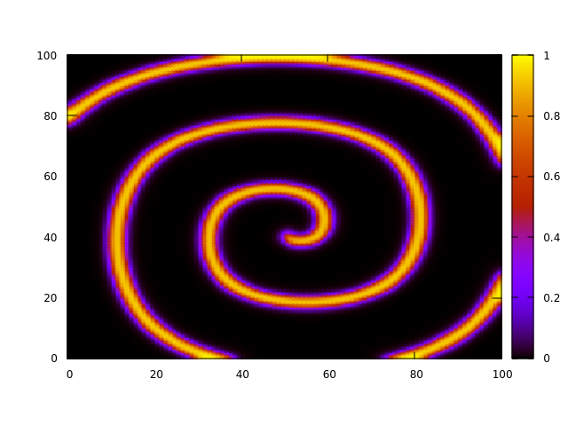
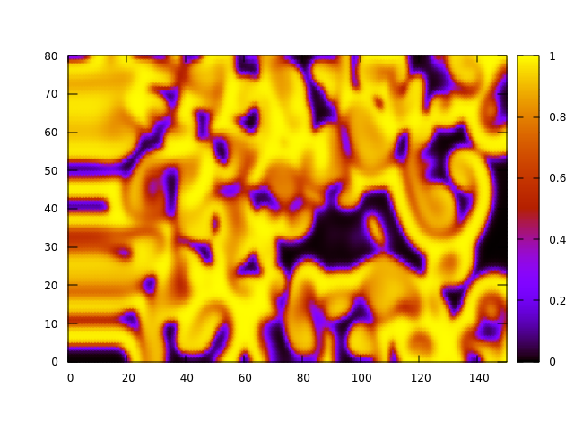

# Parallelization of 2D reaction-diffusion

This project's objective was to write parallel numerical code in C+++ to solve a 2D reaction-diffusion problem, with the goal of maximal computational performance. These types of problems can be quite computationally expensive if there are phenomena covering a wide range of time-scales.

A variant of the Barkley model was considered

$$
\begin{aligned}
\frac{\partial u}{\partial t} - \mu_1 \nabla^2 u = f_1(u,v) \\
\frac{\partial v}{\partial t} - \mu_2 \nabla^2 v = f_2(u,v)
\end{aligned}
$$

where $u_1,u_2$ are coefficients of diffusion and the reaction terms $f_1, f_2$ are given by

$$
\begin{aligned}
f_1(u,v) = \epsilon\  u(1-u) \left( u-\frac{v+b}{a}\right) \\
f_2(u,v) =  u^3 - v
\end{aligned}
$$

with $a,b \in \mathbb R$. 

## Method

Central finite difference was used as the numerical differentiation method and forward (explicit) Euler for time integration. The system of PDEs above can then be written in discrete form as

$$
\begin{aligned}
\frac{u_{i, j}^{n+1}-u_{i, j}^n}{\Delta t} &=\frac{\mu_1}{h^2}\left(u_{i+1, j}^n+u_{i-1, j}^n+u_{i, j+1}^n+u_{i, j-1}^n-4 u_{i, j}^n\right)+f_1\left(u_{i, j}^n, v_{i, j}^n\right) \\
\frac{v_{i, j}^{n+1}-v_{i, j}^n}{\Delta t} &=\frac{\mu_2}{h^2}\left(v_{i+1, j}^n+v_{i-1, j}^n+v_{i, j+1}^n+v_{i, j-1}^n-4 v_{i, j}^n\right)+f_2\left(u_{i, j}^n, v_{i, j}^n\right)
\end{aligned}
$$

The PDE was to be discretized on a $N_x \times N_y$ grid, with $dx=dy=1$ and $\Delta t=0.001$. 

The initial condition of the $u,v$ fields was given by

$$
\begin{aligned}
&u(x, y)= \begin{cases}1 & \text { if } y>L_y / 2 \\
0 & \text { otherwise }\end{cases} \\
&v(x, y)= \begin{cases}a / 2 & \text { if } x<L_x / 2 \\
0 & \text { otherwise }\end{cases}
\end{aligned}
$$

and Neumann boundary conditions were used on all boundaries. 

The objective of the project was to **minimize time-to-solution**.

The code could have been parallelized with either MPI (message-passing paradigm) or OpenMP (memory-sharing paradigm), with the later being chosen after conducting preliminary tests. The [Report](./report.pdf) elaborates on this choice, analyses the parallel scaling of the code for different test cases, describes optimizations made to the code and explains why LAPACK and BLAS were not used in this project.

An additional constraint was that: "code should be able to run on $C$ cores, where $C=c^2$ for integer $1 \leq c\leq 8$".  

## Results

The program was required to output the $u,v$ values at each grid-point, after evolving the system from $t=0$ to $t=T$. To verify code correctness, the system was tested on the following cases 

| Parameters | Case 1      | Case 2 | Case 3 | Case 4 |
| :---: | :---: | :---: | :---: | :---: |
| $N_x$ | 101  |  251    | 101 | 151|
| $N_y$ | 101  | 251 | 101 | 81 |
| $a$ | 0.75 | 0.75 | 0.5 | 0.75 |
| $b$ | 0.06 | 0.06 | 0.1 | 0.0001 |
| $\epsilon$ | 50.0 | 13.0 | 50.0 | 12.5 |
| $\mu_1$ | 5.0 | 5.0 | 5.0 | 1.0 |
| $\mu_2$ | 0.0 | 0.0 | 0.0 | 0.01 |

with their solutions shown below (for $u$ at time $T=100\ s$):

     
     
     
       

## Usage

Usage of the program is documented on the [Makefile](./Makefile). The desired time-step and total integration time must always be provided, while the remaining parameters will take by default the values of *Case 1*.

## Disclaimer

This project was developed as part of a coursework for AERO70011 - High Performance Computing taught by Dr. Chris Cantwell (Imperial College London - MEng Aeronautical Engineering).

